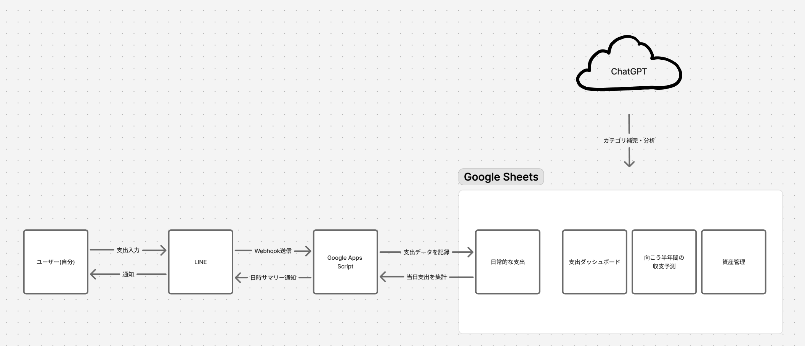

## はじめに

ちょうど1年前くらい前から、「資産形成」「収支管理」「節約」というワードが自分の中でホットになり、一念発起して、家計簿による記録・管理をしようと計画した。

主に以下の項目が、当時知りたかったポイント。

- 自分の支出が月間・年間でどれくらいかかっているのか？
- 収入は毎月いくら入るのか？
  - そのうちいくら税金・社会保険料に消えていくのか？
  - 可処分所得はいくらなのか？
- どのくらい節約をすれば、いくら余剰資金ができるのか？
- いくら投資に回せるのか？

このあたりをクリアにするために、**「記録しやすく、予測が立てやすい」** ことをテーマにしたアプリケーションを作った。

## 技術選定

### 記録しやすさ: LINE

「記録しやすい」というテーマを実現するためにパッと思いついたのがLINE。

LINEは開発者向けのAPIが公開されており、LINEに届いたメッセージをトリガーにして何らかのアクションを実行することができる。

実行先はGASを選択した。正直迷う余地はなかった。

自前でサーバーを立てるというのも考えたが、そこまでハードなことはしないし、そもそもコストがかかる手段を取ることは考えていなかった。

### 予測しやすさ: Google Sheets

「予測が立てやすい」という部分については、Google Sheets（通称スプシ）を使うことで叶えられた。

普段仕事で使うことも多いし、そもそも日常的にmacOSを使用しているためOffice系のサービスが使えないというのもあり、Google Sheetsを採用した。

## 簡易的なアーキテクチャ



画像の通り実装。

具体的な実装方法はこの記事では割愛する。

基本的には、買い物をするたびにLINEに記録するだけ。

入力する項目は以下。

- 決済方法
- 金額
- 買ったもの

決済方法は、現時点では以下を送信できるようになっている。

- 楽天ペイ
- クレカ
- 現金
- PayPay

たとえば、以下のように入力する。

```text
130 コンビニコーヒー 楽天ペイ
```

入力する手間をできるだけ省くため、記入する項目の順番がどうなろうと適切に記録されるようになっている。

つまり、以下のような入力でも同じように処理される。

```text
楽天ペイ 130 コンビニコーヒー
コンビニコーヒー 130 楽天ペイ
```

家計簿は、正確さより先に「続けられること」が大事だと思っている。

そのため、多少雑に入力しても記録できるようにした。

## Google Sheets側で管理しているもの

日常的な支出をもとに、支出のダッシュボードや、半年間の収支予測、資産管理などが算出されるようになっている。

<!-- TODO: カテゴリ別支出ダッシュボードの画像を挿入 -->

Google Sheets側では、LINEから送信された支出データをもとに、以下のような情報を管理している。

- 日常的な支出
- カテゴリ別の支出
- クレジットカードの未払額
- 固定費・予定支払い
- 半年間の収支予測
- 資産管理

特に見たかったのは、**「今月いくら使ったか」だけではなく、「このままだと今月いくら支払うことになりそうか」** という情報。

家計簿アプリでも支出の記録はできるが、自分の場合はクレカ支払い・楽天ペイ・NISA積立・固定費などが混ざっていて、単純な支出合計だけを見ても判断しづらかった。

そのため、Google Sheets側で用途別・支払い方法別に集計し、今月の請求見込みや、今後半年間の収支予測まで見られるようにしている。

## ChatGPTを介在させることのメリット

ChatGPT（Codex）は、Google Sheetsと連携することで、記録された収支や資産状況などを分析するために使っている。

ChatGPTに「マネーコーチ」というプロジェクトを作り、そこから分析させることによって、AIと対話的に収支改善や評価を行うことができる。

### 対話しながら収支を見直せる

単純にダッシュボードを見るだけではなく、気になったことをそのまま聞けるのが便利だった。

たとえば、以下のようなことを質問できる。

- 今月の支出は平時と比べて多いのか？
- どのカテゴリが膨らんでいるのか？
- 固定費と変動費を分けると、実際に削れる余地はどれくらいあるのか？
- 追加でAIサービスに課金しても大丈夫そうか？
- 今月の黒字見込みはいくらか？

家計簿アプリのダッシュボードは基本的に「表示されたものを見る」体験だが、ChatGPTを挟むことで、**数字を見ながら相談できる** 体験になる。

### 実装も手伝ってくれる

また、CodexのComputer Useを使用することで、「こうしたい」と命令するだけで、GASのコードを手で書くことなく自動で実装してくれるのが非常に嬉しいポイント。

実際に、以下のような変更もCodexに依頼しながら進めた。

- LINE入力時の支払い状況の自動判定
- クレカ未払ダッシュボードの改善
- 固定費と当月未払額を合算したLINE返信
- 毎日23時のカテゴリ補完
- 支出カテゴリの追加や既存データの分類補完

自分でコードをすべて書かなくても、運用しながら「こうしたい」をそのまま反映していける。

これによって、Google Sheetsを単なる表計算ツールではなく、より柔軟でカスタマイズ性のある財務管理アプリとして使えるようになった。

## 運用してみてよかったこと

やはり「継続のしやすさ」がポイントになっている。

買ったものを手入力する必要はあるが、それさえやればあとはいい感じに管理できるようになっているのがキモ。

この整備をしたおかげで、月間・年間の収支は大幅に改善されて、長期的な視点で家計を把握することができるようになった。

特によかったのは、**支出を記録すること自体が目的ではなく、次の意思決定につながるようになったこと**。

「今月は使いすぎているのか」「来月以降どれくらい余裕がありそうか」「投資にどれくらい回せそうか」といったことを、感覚ではなく数字を見ながら考えられるようになった。

## 改善ポイント

やはりLINE側の手入力は面倒が残る。

ここはiPhoneのショートカット機能などを駆使したり、音声入力などでなんとかできないか模索中。

将来的には、以下のようなことも試してみたい。

- 音声入力から支出を記録する
- iPhoneのショートカットから決済方法つきで送信する
- レシートや通知から自動で記録する
- カテゴリ補完の精度をさらに上げる

完全自動化まではまだ遠いが、少なくとも「続けられる家計簿」にはかなり近づいたと思っている。
